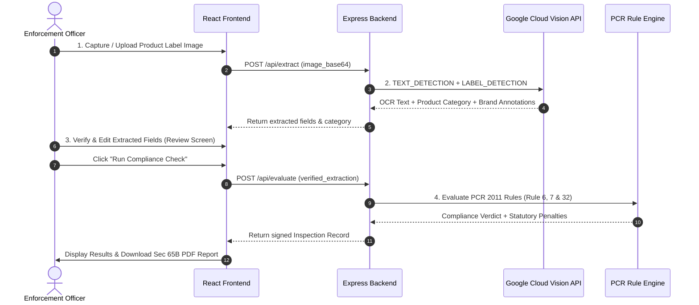

# Technical Architecture Document

## MANAK — Legal Metrology Compliance System

---

## 1. System Architecture Overview

MANAK is designed as a decoupled 4-phase microservices architecture:

```
┌─────────────────────────────────────────────────────────────────────────────┐
│                            FRONTEND (React + Vite)                          │
│                                                                             │
│  [CameraScanScreen] ──► [OcrExtractionScreen] ──► [ExtractedTextReviewScreen]│
│                                                          │                  │
│                                                          ▼                  │
│  [InspectionReportScreen] ◄── [AnalysisResultsScreen] ◄──┘                  │
└─────────────────────────────────────┬───────────────────────────────────────┘
                                      │ REST API Calls
                                      ▼
┌─────────────────────────────────────────────────────────────────────────────┐
│                         BACKEND (Express + TypeScript)                      │
│                                                                             │
│  ├── /api/extract   ──► Google Vision OCR & Categorization Engine           │
│  ├── /api/evaluate  ──► PCR 2011 Rule Evaluation Engine                     │
│  └── /api/dashboard ──► Supabase Analytics & Inspection History Store      │
└─────────────────────────────────────────────────────────────────────────────┘
```

---

## 2. 4-Step Technical Workflow



---

## 3. Module Responsibilities

### 1. `server/services/googleVisionOcr.ts`
- Performs Google Cloud Vision REST API calls (`https://vision.googleapis.com/v1/images:annotate`).
- Features requested:
  - `TEXT_DETECTION` / `DOCUMENT_TEXT_DETECTION`: Verbatim packaging text.
  - `LABEL_DETECTION` & `LOGO_DETECTION`: Product categorization (e.g., Food, Cosmetic, Household, Electronics) and Brand identification.

### 2. `src/services/labelParser.ts`
- Regex pattern parser that maps raw OCR text lines into structured declaration objects:
  - Manufacturer Name, Address & PIN
  - Generic Commodity Name
  - Net Quantity & Unit
  - MRP & Tax Disclaimer
  - Month/Year of Packing
  - Consumer Care Cell
  - Country of Origin
  - Rule 7 Numeral Height Calibration

### 3. `src/components/screens/ExtractedTextReviewScreen.tsx`
- Human-in-the-loop review interface.
- Ensures inspecting officer can edit, correct, or complete any obscured fields before legal evaluation.

### 4. `src/services/ruleEngine.ts`
- Evaluates verified declarations against Legal Metrology (Packaged Commodities) Rules, 2011.
- Computes compounding penalties under Rule 32 / Section 36 of Legal Metrology Act, 2009.

### 5. `src/services/pdfReportGenerator.ts`
- Generates tamper-evident digital evidence report with SHA-256 cryptographic hash certified under Sec 65B of Indian Evidence Act.
